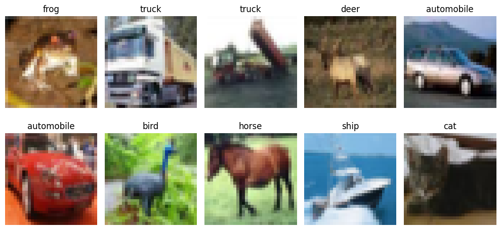
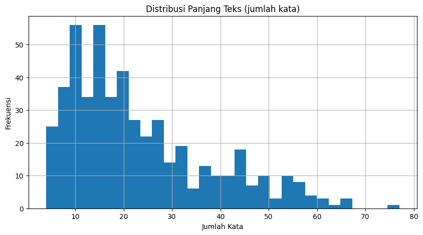

<h1 align="center">Tugas Besar 2 IF3270 Pembelajaran Mesin</h1>
<h2 align="center">Convolutional Neural Network dan Recurrent Neural Network 🧠</h2>

<h3 align="center">CIFAR-10 Datasets Visualization (CNN)</h3>
<div align="center">
  
</div>

<h3 align="center">NusaX-Sentiment Datasets Visualization (RNN & LSTM)</h3>
<div align="center">
  
</div>

## ️🖥️ Deskripsi Umum
Repositori ini dibuat untuk memenuhi Tugas Besar II mata kuliah IF3270 - Pembelajaran Mesin. Proyek ini bertujuan untuk memberikan pemahaman praktis dan mendalam mengenai implementasi arsitektur Convolutional Neural Network (CNN) untuk klasifikasi gambar (image classification) pada dataset CIFAR-10, serta berbagai jenis Recurrent Neural Network (Simple RNN dan LSTM) untuk klasifikasi teks (text classification) pada dataset NusaX-Sentiment.

Tugas ini mencakup dua aspek utama:
1. Melatih dan menganalisis model-model CNN, Simple RNN, dan LSTM menggunakan library Keras. Eksplorasi ini melibatkan investigasi pengaruh berbagai hyperparameter seperti jumlah layer, jumlah filter atau cell, ukuran filter, jenis pooling layer, dan arah pemrosesan RNN/LSTM terhadap kinerja model.
2. Mengimplementasikan fungsi forward propagation untuk ketiga arsitektur tersebut (CNN, Simple RNN, dan LSTM) dari awal (from scratch). Implementasi from scratch ini hanya diizinkan menggunakan library untuk komputasi matematis (seperti NumPy)  dan bertujuan untuk memahami secara fundamental mekanisme kerja internal neural network tersebut. Bobot untuk implementasi from scratch diambil dari model yang telah dilatih menggunakan Keras, dan hasilnya divalidasi dengan membandingkannya terhadap output dari Keras menggunakan metrik macro f1-score.

## 🏃‍♂️ How To Run The Program
Proyek ini melibatkan tiga arsitektur utama *neural network*: Convolutional Neural Network (CNN), Simple Recurrent Neural Network (Simple RNN), dan Long-Short Term Memory (LSTM). Setiap model memiliki kumpulan *script* sendiri untuk pra-pemrosesan data, pelatihan model Keras dan analisis *hyperparameter*, serta implementasi *forward propagation from scratch*.

### Requirements 🛠️

1.  Pastikan Anda telah menginstal Python 3.x.
2.  Direkomendasikan untuk menggunakan *virtual environment* untuk mengelola dependensi.
3.  Instal *library* yang dibutuhkan. Berdasarkan laporan Anda, *library* utama yang digunakan antara lain:
    ```bash
    pip install tensorflow numpy matplotlib scikit-learn pandas
    ```

### Project Directory 📁
Proyek ini disusun sebagai berikut:
```
IF3270_Tubes2_62
├── README.md
├── doc
│   ├── IF3270_Tubes2_62.pdf
│   ├── CIFAR-10.png
│   └── NusaX-Sentiment.png
└── src
    ├── cnn
    │   ├── __pycache__
    │   │   ├── config.cpython-311.pyc
    │   │   ├── data_preprocessing.cpython-311.pyc
    │   │   ├── from_scratch.cpython-311.pyc
    │   │   └── train.cpython-311.pyc
    │   ├── checkpoints
    │   │   ├── 1_layers.weights.h5
    │   │   ├── 2_layers.weights.h5
    │   │   ├── 3_layers.weights.h5
    │   │   ├── 4_layers.weights.h5
    │   │   ├── average_pooling.weights.h5
    │   │   ├── basic_cnn.weights.h5
    │   │   ├── filters_16_32_64.weights.h5
    │   │   ├── filters_32_64_128.weights.h5
    │   │   ├── filters_64_128_256.weights.h5
    │   │   ├── kernels_3x3x3.weights.h5
    │   │   ├── kernels_3x4x5.weights.h5
    │   │   ├── kernels_4x3x3.weights.h5
    │   │   └── max_pooling.weights.h5
    │   ├── config.py
    │   ├── data_preprocessing.py
    │   ├── experiment_results
    │   │   ├── conv_layers_experiment_results.csv
    │   │   ├── filter_numbers_experiment_results.csv
    │   │   ├── kernel_sizes_experiment_results.csv
    │   │   └── pooling_types_experiment_results.csv
    │   ├── from_scratch.py
    │   ├── main_cnn.ipynb
    │   ├── model.py
    │   ├── models
    │   │   ├── cnn_1_layers.keras
    │   │   ├── cnn_2_layers.keras
    │   │   ├── cnn_3_layers.keras
    │   │   ├── cnn_average_pooling.keras
    │   │   ├── cnn_filters_16_32_64.keras
    │   │   ├── cnn_filters_32_64_128.keras
    │   │   ├── cnn_filters_64_128_256.keras
    │   │   ├── cnn_kernels_3x3x3.keras
    │   │   ├── cnn_kernels_3x4x5.keras
    │   │   ├── cnn_kernels_4x3x3.keras
    │   │   └── cnn_max_pooling.keras
    │   ├── results
    │   └── train.py
    ├── lstm
    │   ├── checkpoints
    │   │   ├── baseline_lstm_model.weights.h5
    │   │   ├── lstm_bidirectional_lstm.weights.h5
    │   │   ├── lstm_layers_1.weights.h5
    │   │   ├── lstm_layers_2.weights.h5
    │   │   ├── lstm_layers_3.weights.h5
    │   │   ├── lstm_unidirectional_lstm.weights.h5
    │   │   ├── lstm_units_128.weights.h5
    │   │   ├── lstm_units_32.weights.h5
    │   │   ├── lstm_units_64.weights.h5
    │   │   └── optimal_lstm_l1_u32_bi.weights.h5
    │   ├── config.py
    │   ├── data
    │   │   ├── test.csv
    │   │   ├── train.csv
    │   │   └── valid.csv
    │   ├── data_preprocessing.py
    │   ├── experiment_results_lstm
    │   │   ├── lstm_bidirectional_results.csv
    │   │   ├── lstm_layer_count_results.csv
    │   │   ├── lstm_unit_count_results.csv
    │   │   └── lstm_variation_summary.csv
    │   ├── from_scratch_lstm.py
    │   ├── main_lstm.ipynb
    │   ├── model.py
    │   ├── models
    │   │   ├── baseline_lstm_model_full_model.keras
    │   │   ├── baseline_lstm_model_vectorizer.keras
    │   │   ├── lstm_bidirectional_lstm_full_model.keras
    │   │   ├── lstm_bidirectional_lstm_vectorizer.keras
    │   │   ├── lstm_layers_1_full_model.keras
    │   │   ├── lstm_layers_1_vectorizer.keras
    │   │   ├── lstm_layers_2_full_model.keras
    │   │   ├── lstm_layers_2_vectorizer.keras
    │   │   ├── lstm_layers_3_full_model.keras
    │   │   ├── lstm_layers_3_vectorizer.keras
    │   │   ├── lstm_unidirectional_lstm_full_model.keras
    │   │   ├── lstm_unidirectional_lstm_vectorizer.keras
    │   │   ├── lstm_units_128_full_model.keras
    │   │   ├── lstm_units_128_vectorizer.keras
    │   │   ├── lstm_units_32_full_model.keras
    │   │   ├── lstm_units_32_vectorizer.keras
    │   │   ├── lstm_units_64_full_model.keras
    │   │   ├── lstm_units_64_vectorizer.keras
    │   │   ├── optimal_lstm_l1_u32_bi_full_model.keras
    │   │   └── optimal_lstm_l1_u32_bi_vectorizer.keras
    │   └── train.py
    └── simplernn
        ├── checkpoints
        │   ├── baseline_model.weights.h5
        │   ├── optimal_rnn_l1_u96_bi.weights.h5
        │   ├── rnn_bidirectional.weights.h5
        │   ├── rnn_layers_1.weights.h5
        │   ├── rnn_layers_2.weights.h5
        │   ├── rnn_layers_3.weights.h5
        │   ├── rnn_unidirectional.weights.h5
        │   ├── rnn_units_24.weights.h5
        │   ├── rnn_units_48.weights.h5
        │   └── rnn_units_96.weights.h5
        ├── config.py
        ├── data
        │   ├── test.csv
        │   ├── train.csv
        │   └── valid.csv
        ├── data_preprocessing.py
        ├── experiment_results
        │   ├── bidirectional_results.csv
        │   ├── layer_count_results.csv
        │   ├── unit_count_results.csv
        │   └── variation_summary.csv
        ├── from_scratch.py
        ├── main_rnn.ipynb
        ├── model.py
        ├── models
        │   ├── baseline_model_full_model.keras
        │   ├── baseline_model_vectorizer.keras
        │   ├── optimal_rnn_l1_u96_bi_full_model.keras
        │   ├── optimal_rnn_l1_u96_bi_vectorizer.keras
        │   ├── rnn_bidirectional_full_model.keras
        │   ├── rnn_bidirectional_vectorizer.keras
        │   ├── rnn_layers_1_full_model.keras
        │   ├── rnn_layers_1_vectorizer.keras
        │   ├── rnn_layers_2_full_model.keras
        │   ├── rnn_layers_2_vectorizer.keras
        │   ├── rnn_layers_3_full_model.keras
        │   ├── rnn_layers_3_vectorizer.keras
        │   ├── rnn_unidirectional_full_model.keras
        │   ├── rnn_unidirectional_vectorizer.keras
        │   ├── rnn_units_24_full_model.keras
        │   ├── rnn_units_24_vectorizer.keras
        │   ├── rnn_units_48_full_model.keras
        │   ├── rnn_units_48_vectorizer.keras
        │   ├── rnn_units_96_full_model.keras
        │   └── rnn_units_96_vectorizer.keras
        └── train.py
```

### Running Experiment ⚙️

Untuk setiap model (CNN, Simple RNN, LSTM), cara utama untuk menjalankan eksperimen, melatih model Keras, dan menguji implementasi *from scratch* adalah melalui Jupyter Notebook masing-masing:
* `src/cnn/main_cnn.ipynb`
* `src/simplernn/main_rnn.ipynb`
* `src/lstm/main_lstm.ipynb`

**Alur Kerja Umum dalam Setiap Notebook:**

1.  **Navigasi ke direktori `src/<tipe_model>/`.**
2.  **Luncurkan Jupyter Notebook:**
    ```bash
    jupyter notebook main_<tipe_model>.ipynb
    ```
3.  **Ikuti sel-sel dalam notebook.** Notebook biasanya disusun untuk:
    * Mengimpor *library* dan modul yang diperlukan (misalnya, `config.py`, `model.py`, `train.py`, `data_preprocessing.py`, `from_scratch.py`).
    * Memuat dan melakukan pra-pemrosesan data (misalnya, CIFAR-10 untuk CNN, NusaX-Sentiment untuk RNN/LSTM).
        * Untuk CNN, ini termasuk membagi *training set* CIFAR-10 menjadi *training set* baru dan *validation set*.
        * Untuk RNN/LSTM, ini melibatkan proses *tokenization* menggunakan `TextVectorization` dan membuat sekuens *embedding*.
    * **Pelatihan Model Keras dan Analisis *Hyperparameter*:**
        * Mendefinisikan berbagai konfigurasi model (variasi jumlah *layer*, *filter/cell*, ukuran *kernel*, tipe *pooling*, arah pemrosesan) sesuai dengan "Spesifikasi Tugas Besar 2".
        * Menggunakan fungsi `create_<tipe_model>_model` dari `<tipe_model>/model.py` untuk membangun model Keras.
        * Melatih model menggunakan fungsi `train_and_evaluate_model` (atau serupa) dari `<tipe_model>/train.py`.
        * *Callback* seperti `ModelCheckpoint`, `EarlyStopping`, dan `ReduceLROnPlateau` akan digunakan selama pelatihan.
        * Menganalisis hasil: Membandingkan F1-*score*, grafik *training/validation loss*, dan menarik kesimpulan mengenai pengaruh *hyperparameter*.
        * Bobot model Keras terbaik atau yang representatif akan disimpan (misalnya, di direktori `checkpoints/` atau `models/`). Model Keras penuh dan *vectorizer* (untuk RNN/LSTM) juga disimpan.
    * **Implementasi dan Validasi *Forward Propagation From Scratch*:**
        * Memuat model Keras yang telah dilatih beserta bobotnya (dan *vectorizer* untuk RNN/LSTM).
        * Membuat instansiasi kelas model *from scratch* (misalnya, `CNNFromScratch`, `SimpleRNNFromScratch`, `LSTMFromScratch`) dari file `from_scratch.py` atau `from_scratch_lstm.py` masing-masing. Kelas-kelas ini akan memuat bobot Keras.
        * Melakukan prediksi pada *test set* menggunakan metode `predict` dari model Keras dan metode `forward` (atau `predict`) kustom dari model *from scratch*.
        * Membandingkan output:
            * *Macro f1-score* untuk keduanya.
            * Waktu prediksi.
            * Mean Absolute Error (MAE) antara probabilitas prediksi.
            * *Classification report* dan *confusion matrix*.

**Contoh: Menjalankan bagian CNN (langkah-langkah konseptual dalam `main_cnn.ipynb`)**

```python
# (Di dalam main_cnn.ipynb)

# 1. Impor modul yang diperlukan dari src.cnn
from config import ES_PATIENCE, LR_FACTOR # ... dan konfigurasi lainnya
from model import create_cnn_model
from train import train_and_evaluate_model, plot_combined_comparison
from data_preprocessing import load_cifar10_data
from from_scratch import CNNFromScratch, run_from_scratch_comparison 

# 2. Muat dan lakukan pra-pemrosesan data CIFAR-10
(x_train, y_train), (x_val, y_val), (x_test, y_test), class_names = load_cifar10_data() 

# 3. Pelatihan Model Keras & Analisis Hyperparameter
# Contoh: Eksperimen dengan jumlah layer konvolusi
# (Loop melalui jumlah layer, filter, ukuran kernel, tipe pooling yang berbeda sesuai spesifikasi)
# Untuk konfigurasi spesifik:
num_conv_layers = 2
filters = [32, 64]
kernels = [3, 3]
pooling = 'max'
model_name = f"cnn_{num_conv_layers}layers_{pooling}"

keras_cnn_model = create_cnn_model(
    conv_layers=num_conv_layers,
    filters_per_layer=filters,
    kernel_sizes=kernels,
    pooling_type=pooling
)
keras_cnn_model.summary()

trained_model, history, test_f1 = train_and_evaluate_model(
    keras_cnn_model,
    x_train, y_train, x_val, y_val, x_test, y_test,
    model_name=model_name,
    epochs=10 # Atau dari config
)
# ... (plotting, penyimpanan hasil untuk eksperimen ini) ...

# (Setelah menemukan model yang baik atau untuk model representatif)
# Asumsikan 'checkpoints/best_cnn_model.weights.h5' atau 'models/best_cnn_model_full.keras' disimpan

# 4. Validasi Forward Propagation From Scratch
# Path ke model Keras yang disimpan (pastikan model ini telah dilatih dan disimpan)
saved_keras_model_path = "models/best_cnn_model_full.keras" # Atau path yang sesuai

# Jalankan perbandingan
# Fungsi ini akan memuat model Keras, menginisialisasi CNNFromScratch,
# menjalankan prediksi, dan mencetak metrik perbandingan.
run_from_scratch_comparison(model_path=saved_keras_model_path)
```

## 🧑‍🏭Pembagian Pekerjaan
<table border="1">
  <thead>
    <tr>
      <th>NIM</th>
      <th>Nama</th>
      <th>Pekerjaan</th>
    </tr>
  </thead>
  <tbody>
    <tr>
      <td>13522124</td>
      <td>Aland Mulia Pratama</td>
      <td>Mengimplementasikan CNN (Convolutional Neural Network) yang mencakup pembuatan file konfigurasi, preprocessing data, model, train, dan juga implementasi forward propagation from scratch. Mengerjakan laporan Deskripsi Persoalan, Implementasi CNN, Pengujian CNN, serta Daftar Pustaka.</td>
    </tr>
    <tr>
      <td>13522132</td>
      <td>Hafizh Hananta Akbari</td>
      <td>Tidak Mengerjakan Sama Sekali</td>
    </tr>
    <tr>
      <td>13522135</td>
      <td>Christian Justin Hendrawan</td>
      <td>Mengimplementasikan Simple RNN dan LSTM yang mencakup pembuatan file konfigurasi, preprocessing, model, train, dan implementasi from scratch. Mengerjakan laporan implementasi dan hasil pengujian Simple RNN dan LSTM, Kesimpulan & Saran, serta merapihkan format laporan.</td>
    </tr>
  </tbody>
</table>
